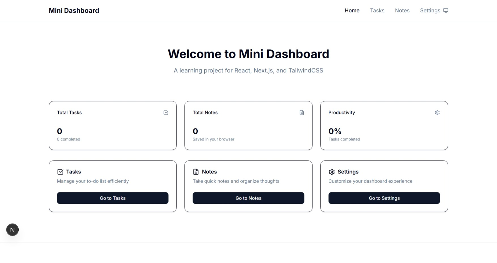
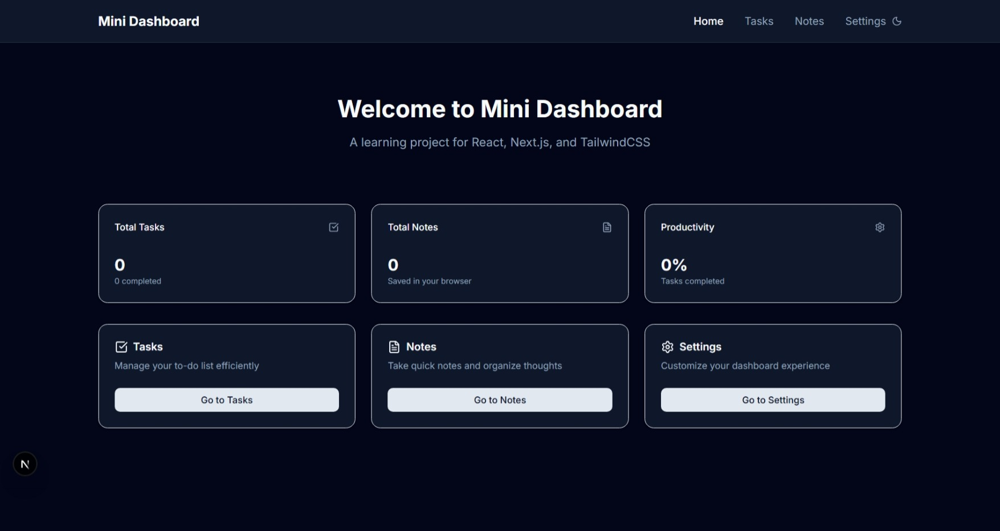
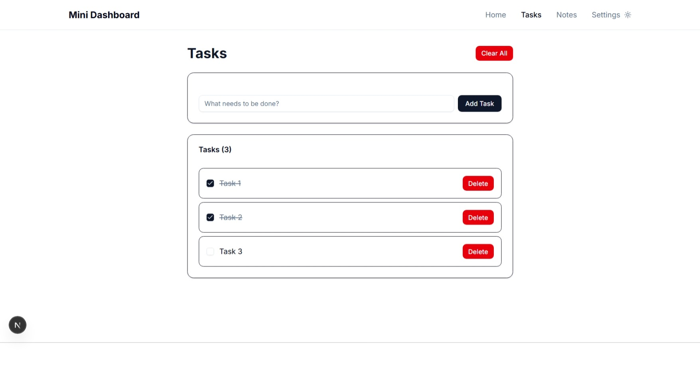
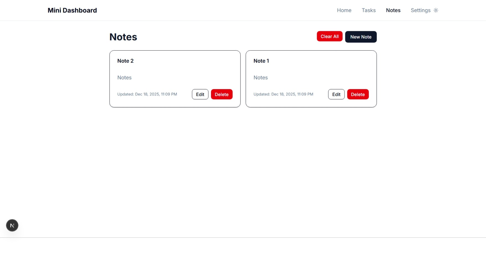
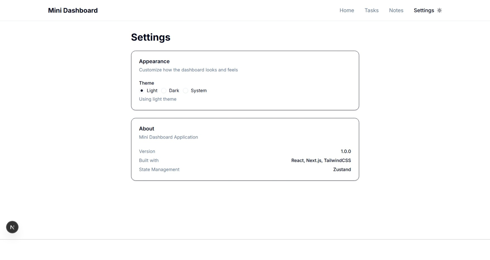

# Mini Dashboard App

A modern, feature-rich personal dashboard application built with Next.js, TypeScript, and TailwindCSS. Manage your tasks, take notes, and customize your experience with a beautiful dark mode theme.


## Live Demo

[**View Live Demo**](#)

## Screenshots

### Light Mode

*Clean and professional light theme interface*

### Dark Mode

*Eye-friendly dark theme for late-night productivity*

### Features Overview



*Task management, notes, and settings at your fingertips*

---

## Features

### Task Management
- Create, edit, and delete tasks
- Mark tasks as complete
- Real-time task counter
- Persistent storage (data saved locally)
- Bulk delete with confirmation dialog

### Note Taking
- Create and organize notes
- Rich text support with multi-line content
- Edit existing notes
- Timestamp tracking (created & updated)
- Grid layout for better organization

### Settings & Customization
- Dark/Light/System theme modes
- Smooth theme transitions
- Settings persistence across sessions
- Real-time theme switching

### Dashboard Analytics
- Task completion statistics
- Total tasks and notes overview

### UI/UX Excellence
- Responsive design (mobile, tablet, desktop)
- Modern, clean interface
- Intuitive navigation
- Accessible components
- Smooth animations and transitions

---

## Tech Stack

### Frontend Framework
- **Next.js 15** - React framework with App Router
- **React 19** - UI component library
- **TypeScript** - Type-safe development

### Styling
- **TailwindCSS 4** - Utility-first CSS framework
- **shadcn/ui** - Re-usable component library
- **lucide-react** - Beautiful icon set

### State Management
- **Zustand** - Lightweight state management
- **localStorage** - Client-side data persistence

### Development Tools
- **ESLint** - Code linting
- **Prettier** (optional) - Code formatting
- **Git** - Version control

---

## Getting Started

### Prerequisites

Before running this project, make sure you have:
- **Node.js** (v18 or higher)
- **npm** or **yarn**
- **Git**

### Installation

1. **Clone the repository**
   ```bash
   git clone https://github.com/YOUR_USERNAME/mini-dashboard.git
   cd mini-dashboard
   ```

2. **Install dependencies**
   ```bash
   npm install
   # or
   yarn install
   ```

3. **Run the development server**
   ```bash
   npm run dev
   # or
   yarn dev
   ```

4. **Open your browser**
   
   Navigate to [http://localhost:3000](http://localhost:3000)

### Building for Production

```bash
# Create production build
npm run build

# Start production server
npm start
```

---

## Project Structure

```
mini-dashboard/
├── app/                      # Next.js App Router pages
│   ├── layout.tsx           # Root layout with navigation
│   ├── page.tsx             # Home page with stats
│   ├── tasks/
│   │   └── page.tsx         # Task management page
│   ├── notes/
│   │   └── page.tsx         # Note-taking page
│   └── settings/
│       └── page.tsx         # Settings and theme page
├── components/              # React components
│   ├── ui/                  # shadcn/ui components
│   ├── Navbar.tsx           # Navigation bar
│   ├── TaskItem.tsx         # Individual task component
│   ├── NoteCard.tsx         # Individual note component
│   └── ThemeProvider.tsx    # Theme management wrapper
├── lib/                     # Utilities and business logic
│   ├── types.ts             # TypeScript type definitions
│   ├── storage.ts           # localStorage helper functions
│   ├── taskStore.ts         # Zustand store for tasks
│   ├── noteStore.ts         # Zustand store for notes
│   └── settingsStore.ts     # Zustand store for settings
└── public/                  # Static assets
```

---

## Core Concepts Demonstrated

### 1. **Component-Based Architecture**
- Reusable UI components
- Props and component composition
- TypeScript interfaces for type safety

### 2. **State Management**
- Global state with Zustand
- Local component state with useState
- Persistent state with localStorage

### 3. **Modern React Patterns**
- React Hooks (useState, useEffect, useCallback)
- Custom hooks
- Client and Server Components

### 4. **Next.js Features**
- App Router file-based routing
- Layout composition
- TypeScript integration

### 5. **Styling Best Practices**
- Utility-first CSS with Tailwind
- CSS variables for theming
- Responsive design patterns

---

## What I Learned

Building this project helped me master:

- **Next.js App Router** - File-based routing and layouts
- **TypeScript** - Type-safe React development
- **Zustand** - Lightweight state management
- **TailwindCSS** - Rapid UI development
- **Component Libraries** - Integration and customization
- **localStorage API** - Client-side data persistence
- **Dark Mode** - CSS variables and theme switching
- **Responsive Design** - Mobile-first approach
- **Git & GitHub** - Version control and collaboration

---

## Future Enhancements

### Planned Features
- [ ] Task due dates and reminders
- [ ] Task categories and tags
- [ ] Search and filter functionality
- [ ] Drag-and-drop task reordering
- [ ] Calendar view for tasks
- [ ] Export/import data (JSON)
- [ ] Task priority levels
- [ ] Rich text editor for notes
- [ ] Note categories
- [ ] Statistics and analytics page

### Technical Improvements
- [ ] Add backend with Supabase
- [ ] User authentication
- [ ] Cloud data sync
- [ ] Real-time collaboration
- [ ] Mobile app (React Native)
- [ ] Progressive Web App (PWA)
- [ ] Unit and integration tests

---

## Contributing

Contributions, issues, and feature requests are welcome!

1. Fork the project
2. Create your feature branch (`git checkout -b feature/AmazingFeature`)
3. Commit your changes (`git commit -m 'Add some AmazingFeature'`)
4. Push to the branch (`git push origin feature/AmazingFeature`)
5. Open a Pull Request

---

## License

This project is licensed under the **MIT License** - see the [LICENSE](LICENSE) file for details.

---

## Acknowledgments

- [Next.js](https://nextjs.org/) - The React Framework
- [shadcn/ui](https://ui.shadcn.com/) - Beautiful component library
- [Zustand](https://github.com/pmndrs/zustand) - Simple state management
- [TailwindCSS](https://tailwindcss.com/) - Utility-first CSS
- [Lucide Icons](https://lucide.dev/) - Beautiful icons

---

## Support

If you like this project, please consider:
- ⭐ Starring the repository
- 🐛 Reporting bugs
- 💡 Suggesting new features
- 📢 Sharing with others

---